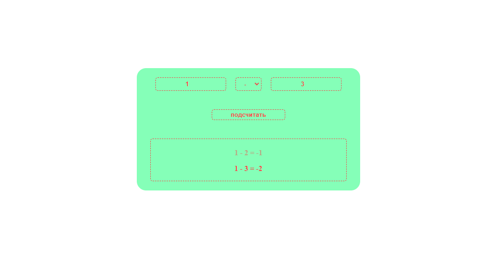

# Безопасность веб-приложений. Лабораторка №1

## Основное задание

Сделать одностраничное автономное браузерное приложение "Калькулятор".
На странице должно быть два поля ввода для чисел и выбор операции между ними.

По нажатию на кнопку должен вычисляться результат и выводиться в текстовое поле.
Приложение должно контролировать формат вводимых значений и по необходимости сообщать об ошибке.

## Дополнительное задания

1. Компоновка страницы должна адаптироваться под размер экрана.

2. Поле результатов должно содержать несколько предыдущие операции бледным шрифтом.

3. При ошибке в одном из полей ввода оно должно подсвечиваться и даваться сообщение о том, что не так.

4. Стилизовать элементы в точности, как на поясняющем рисунке.

